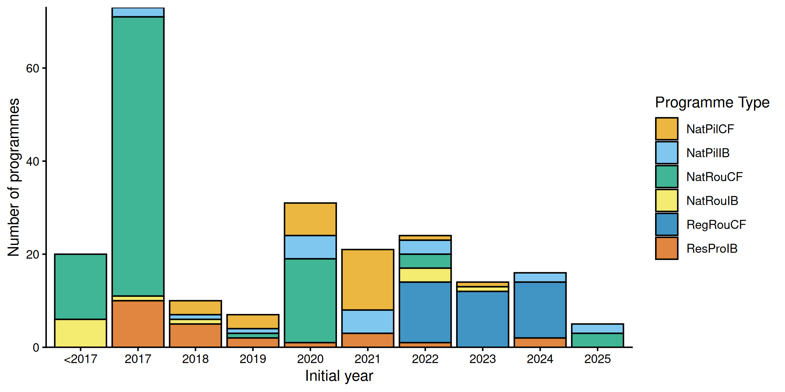
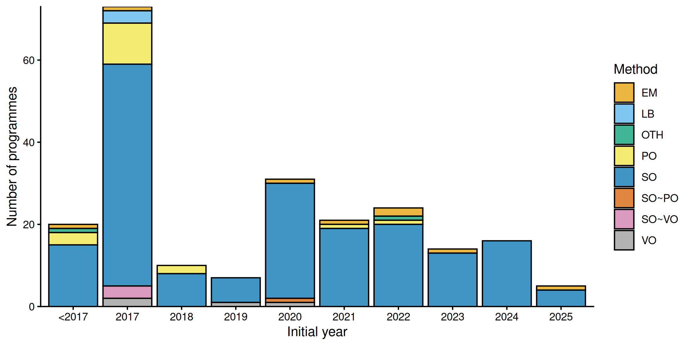
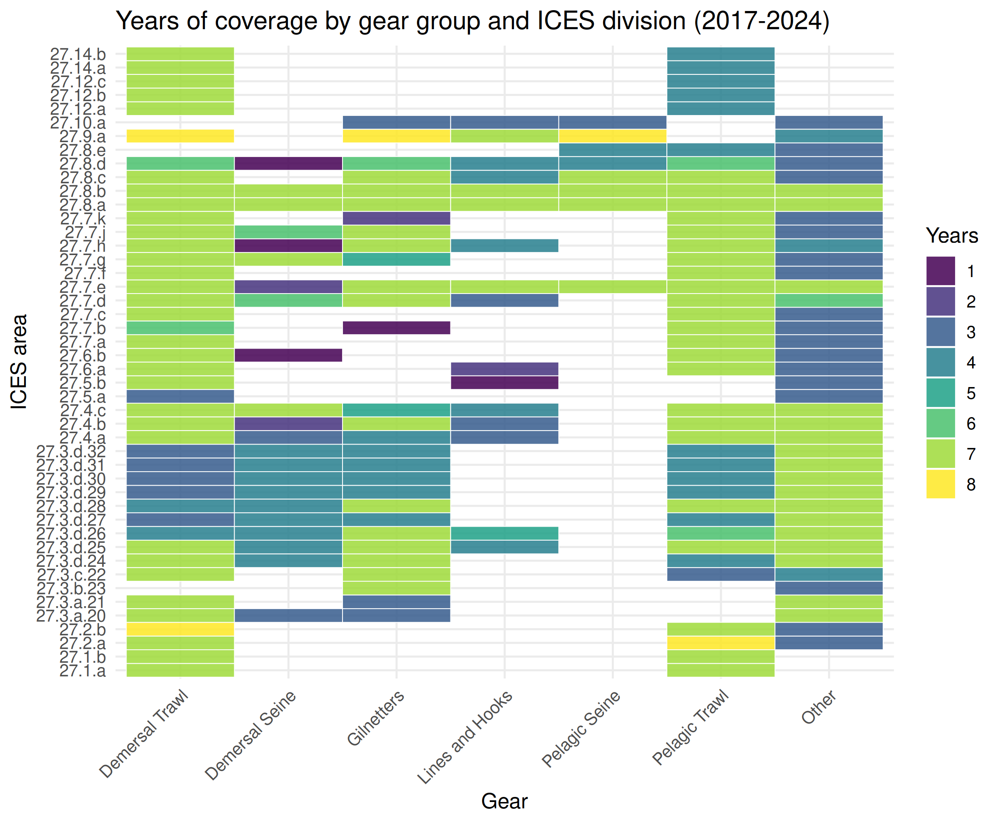
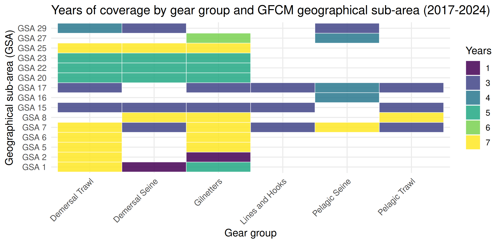
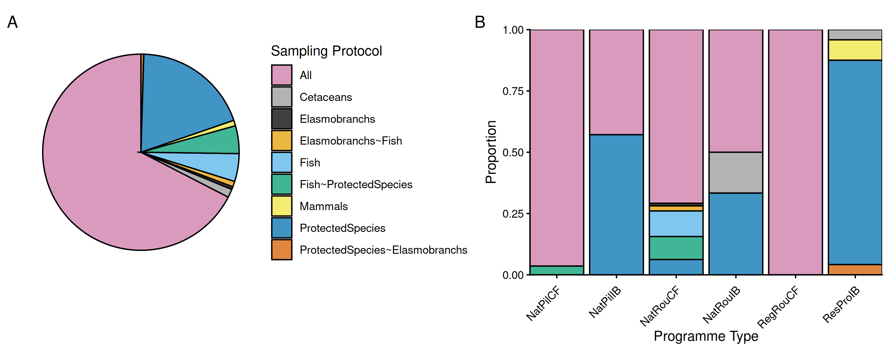
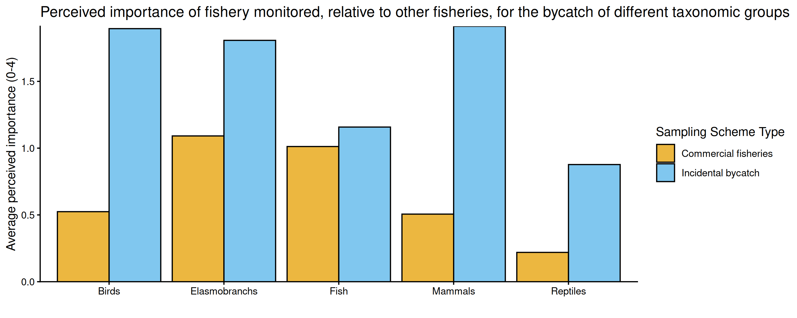
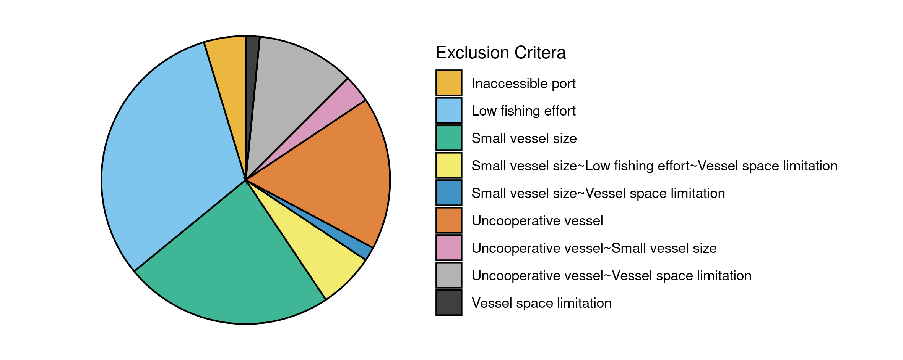
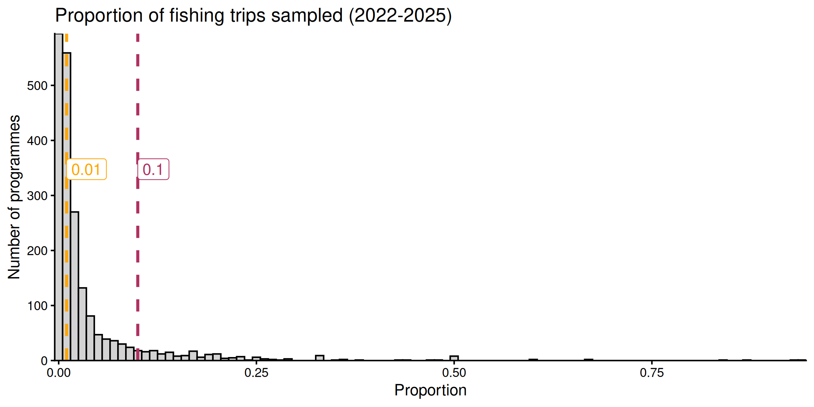

```{r setup, include=FALSE}
knitr::opts_chunk$set(echo = FALSE, message = FALSE, warning = FALSE)
```


```{r}
# PACKAGES
library(dplyr)
library(DT)
```


# Overview

Number of countries responded in the 2020 and 2025 datacall respectively.

```{r}
d2all <- read.taf("data/d2all.csv")

d2Tab <- d2all %>%
  group_by(Source) %>%
  summarise(NoCountries = length(unique(Country)),
            Countries = paste0(sort(unique(Country)), collapse = ", "))

d2Tab  %>%
  datatable(extensions = 'Buttons', rownames = FALSE,
            options = list(dom = 'Blfrtip',
                           buttons = c('copy', 'csv', 'excel'),
                           lengthMenu = list(c(10,25,50,-1),
                                             c(10,25,50,"All"))))
```


## Gear/Metier groupings

The metiers reported by each country were grouped into six categories:

1. Pelagic trawl
2. Demersal trawl
3. Demersal seine
4. Pelagic seine
5. Lines and hooks
6. Others

The table below shows how metiers were grouped to the categories above:

```{r}
tabgear <- readRDS("model/tabgear.rds")

tabgear %>%
  datatable(extensions = 'Buttons', rownames = FALSE,
            options = list(dom = 'Blfrtip',
                           buttons = c('copy', 'csv', 'excel'),
                           lengthMenu = list(c(10,25,50,-1),
                                             c(10,25,50,"All"))))
```

## Figure 1: Count of bycatch monitoring programmes by type and initial year 
NatPilCF = national pilot commercial fisheries,NatPilIB = national pilot incidental bycatch, NatRouCF = national routine commercial fisheries, NatRouIB = national routine incidental bycatch, RegPilCF = regional pilot commercial fisheries, RegPilIB = regional pilot incidental bycatch, RegRouCF = regional routine commercial fisheries, ResProIB = research project incidental bycatch. Note that results from 2025 are likely incomplete because of the data call timing.
```{r}

```

## Figure 2: Count of bycatch monitoring programmes by monitoring method and start year

EM = electronic monitoring, LB = logbooks, OTH = other, PO = port observer, SO = scientific observer, VO = vessel observer. Note that results from 2025 are likely incomplete because of the data call timing.

```{r}

```

## Figure 3: Coverage by gear group in ICES areas
Number of years in which each ICES area–gear combination was monitored for endangered, threatened, and protected (ETP) bycatch between 2017–2024. Analysis based on this inventory combined with the previous version (ICES, 2022). See Table A1 for gear categorization. This analysis did not account for fishing effort, and some of the area–gear combinations lacking monitoring coverage may also lack fishing activity.

```{r}

```

## Figure 4: Years of coverage by gear group and GFCM sub-area
Number of years in which each General Fisheries Commission for the Mediterranean (GFCM) area–gear combination was monitored for endangered, threatened, and protected (ETP) bycatch between 2017–2024. Analysis based on this inventory combined with previous version (ICES, 2022). See Table A1 for gear categorization. This analysis did not account for fishing effort, and some of the area–gear combinations lacking monitoring coverage may also lack fishing activity.

```{r}

```

## Figure 5: Sampling protocol breakdown
Proportion of bycatch monitoring programmes using different sampling protocols, for all reported programmes (A) and by programme type (B). NatPilCF = national pilot commercial fisheries, NatPilIB = national pilot incidental bycatch, NatRouCF = national routine commercial fisheries, NatRouIB = national routine incidental bycatch, RegPilCF = regional pilot commercial fisheries, RegPilIB = regional pilot incidental bycatch, RegRouCF = regional routine commercial fisheries, ResProIB = research project incidental bycatch

```{r}

```

##Figure 6: Perceived importance
Average perceived importance of monitored fishery, relative to other fisheries, for bycatch of various taxa, according to data call respondents. Ratings were given on a scale of 0–4. Averages are shown for all programmes sampling commercial fisheries compared with all programmes dedicated to monitoring incidental bycatch.

```{r}

```

##Figure 7: Breakdown of reasons for vessels being excluded from bycatch monitoring programmes

```{r}

```

##Figure 8: Sampling coverage
For monitoring programmes newly described in this inventory update (2022–2025), proportion of fishing trips sampled for endangered, threatened, and protected (ETP) bycatch. Dashed lines show values of 0.01 (orange) and 0.1 (magenta).

```{r}

```
